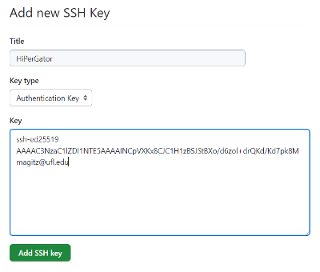

# Setting up `git` and GitHub

To set up `git` and your GitHub.com account on your computer, there are three main steps.

1. You need to create an SSH key pair on the computer that will connect to GitHub.
1. Then, load the **public** key into your GitHub account settings.
1. You also need to configure your username and email for `git` so that it can track who makes changes to repositories.

> **Note:** If you are unfamiliar with the Linux command line, and would rather complete these steps using a Jupyter notebook, check out the [*Practicum AI* notebook here](https://github.com/PracticumAI/computing-for-ai/blob/main/02_git_configuration_HiPerGator.ipynb). It completes all the steps below without you needing to use the command line.

## Step 1: Create an SSH key pair

For this exercise, we will use HiPerGator, the University of Florida's supercomputer as the computer that will connect to GitHub. You can generally use these directions for any computer, or check out [GitHub's directions on how to set up your SSH keys](https://docs.github.com/en/authentication/connecting-to-github-with-ssh).

* Log into HiPerGator. 
   > In the examples below, the text "`[magitz@login10 ~]$`" is my command prompt when logged in, and should *not* be part of what you type.
* SSH keys should be stored in a folder in your home directory, called `.ssh`. This is a hidden folder (because of the `.` at the start of the name). Permissions on this folder are also important to ensure security, so generally, don't change them.
   * Make sure you are in your home directory, and check to see if you have an appropriate SSH key pair (see the [GitHub page](https://docs.github.com/en/authentication/connecting-to-github-with-ssh/checking-for-existing-ssh-keys) for more details):
     ```bash
     [magitz@login10 ~]$ cd
     [magitz@login10 ~]$ ls .ssh/id_ed25519*
     .ssh/id_ed25519  .ssh/id_ed25519.pub
     [magitz@login10 ~]$
     ``` 
     > In this example, I do have the key pair, and I can skip creating them. If you do not see anything listed, you will need to create them as in the next step.
  * If you do not have an id_ed25519 key pair, make one.   Paste the text below, substituting in your GitHub email address (see the [GitHub page](https://docs.github.com/en/authentication/connecting-to-github-with-ssh/generating-a-new-ssh-key-and-adding-it-to-the-ssh-agent) for more details).
     ```bash
    [magitz@login10 ~]$ ssh-keygen -t ed25519 -C "your_email@example.com"
    Generating public/private ed25519 key pair.
    Enter file in which to save the key (/home/magitz/.ssh/id_ed25519):
     ```
     > Do not change the path or name of this file. GitHub needs the file to be located in your `~/.ssh` directory and only looks for files with specific names! **Just hit Enter and accept the default**.
     
     ```bash
     Enter passphrase (empty for no passphrase):
     ```

     > If you want to use your key in Jupyter or other graphical environment, you should leave the passphrase blank. While this is not a best practice for security, Jupyter Lab, does not recognize SSH key passphrases. **Hit Enter to use no passphrase, and again to confirm.**

     The whole process should look like this:
     ```
     [magitz@login10 ~]$ ssh-keygen -t ed25519 -C "magitz@ufl.edu"
        Generating public/private ed25519 key pair.
        Enter file in which to save the key (/home/magitz/.ssh/id_ed25519): 
        Enter passphrase (empty for no passphrase): 
        Enter same passphrase again: 
        Your identification has been saved in /home/magitz/.ssh/id_ed25519.
        Your public key has been saved in /home/magitz/.ssh/id_ed25519.pub.
        The key fingerprint is:
        SHA256:QUVjge9GGK/kp0gizhcaYAlbER9qPXYR0zu+rj4YbSM magitz@ufl.edu
        The key's randomart image is:
        +--[ED25519 256]--+
        |  oo. +o.+*.     |
        |. .+ . ++. .     |
        |.o+ = . .*       |
        |o+ . o  =.+      |
        |..   . +S=       |
        |  o E = + +      |
        | o + O o =       |
        |  + o o o        |
        |   . .o+.        |
        +----[SHA256]-----+
        [magitz@login10 ~]
     ```


## Step 2: Load your public key in GitHub

To use SSH authentication, you keep the private key (`~/.ssh/id_ed25519`) on your computer, and put the public key (`~/.ssh/id_ed25519.pub`) on the server you want to connect to (GitHub.com in our case). To do this with GitHub, you add the public key to your account in the settings menu. (see the [GitHub page](https://docs.github.com/en/authentication/connecting-to-github-with-ssh/adding-a-new-ssh-key-to-your-github-account) for more details)

* When logged into GitHub, go to [https://github.com/settings/keys](https://github.com/settings/keys). Or, navigate to Settings > SSH and GPG Keys.
* Click the Green "New SSH Key" button: [](https://github.com/settings/ssh/new)
* Type a name for the key: "HiPerGator" for example.
* Return to your terminal from step 1 and type: `cat ~/.ssh/id_ed25519.pub` and copy the line of output (depending on your screen, it may wrap around on multiple lines, copy the whole thing.)
* Paste the line into the GitHub window. It should look similar to this:

* Click the green "Add SSH key"

## Step 3: Configure `git` and test your key

Before you can use `git` you need to configure your user name and email address which are used to track who made the changes.

* Run the following 2 commands using your Name (inside quotes) and email address (without quotes):

   ```
   [magitz@login10 ~]$ git config --global user.name 'Your Name'
   [magitz@login10 ~]$ git config --global user.email your_email@example.com
   ```
* Now we should test everything to make sure you can authenticate to GitHub with your SSH keys (see the [GitHub page](https://docs.github.com/en/authentication/connecting-to-github-with-ssh/testing-your-ssh-connection) for more details. Type this as-is (**do not change the username**: `git` is the correct username to use. The reply will, however, have your GitHub username)

    ```
    [magitz@login10 ~]$ ssh -T git@github.com
    Hi magitz! You've successfully authenticated, but GitHub does not provide shell access.
    [magitz@login10 ~]$ 
    ```
* That reply is your indication that things are setup correctly! You may be asked if you trust the host, type `yes` to add the key.
